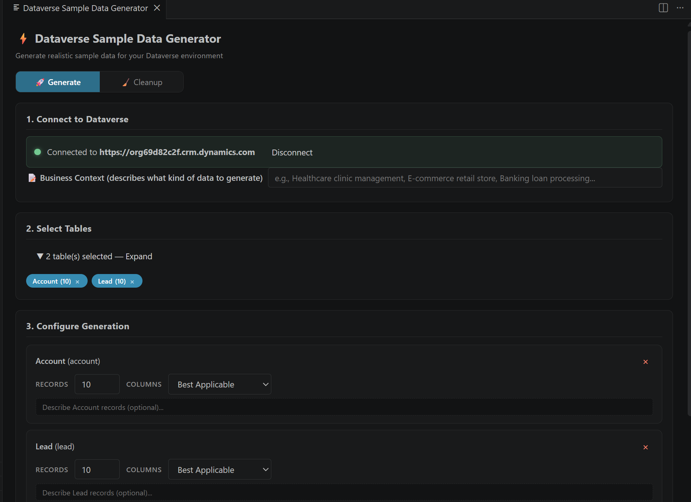

# Dataverse Sample Data Generator

**The first tool that generates contextually meaningful sample data for Microsoft Dataverse — powered by AI.**

---

## The Problem

Every Dataverse consultant, developer, and tester faces the same challenge: **generating realistic sample data is painful.**

- Building a demo for a client? You need 200 accounts, 500 contacts, and 1,000 cases — and they all need to look *real*.
- Setting up a trial instance? You're manually typing records one by one, or importing flat CSVs with no relationships.
- Testing a Power Automate flow? You need data across multiple related tables, with proper lookups wired up.

Existing tools can generate random data — random names, random numbers, random strings. But **no tool in the market generates data that is contextually meaningful**. You get "John Doe" and "123 Main St" regardless of whether you're building a healthcare app in Singapore or a retail chain in Germany.

Until now.

## What Makes This Different

This extension uses the **AI language models built into GitHub Copilot** to generate data that actually makes sense for your scenario. It doesn't just fill columns with random values — it understands your business context and produces data that tells a coherent story.

### Business Context Changes Everything

Give the tool a simple description like *"Healthcare clinic in Singapore"* or *"Law firm in London"*, and the AI generates data that fits — region-appropriate names, industry-specific job titles, realistic case descriptions, matching email domains. Across related tables, the context stays consistent: accounts, contacts, and cases all tell the same coherent story.

Without context, you get `Test Account 47` and `City_0293`. With context, your demo environment looks like production.

## Why a VS Code Extension?

This tool is built as a **VS Code extension by design** — not a web app, not a standalone tool. Here's why:

**It runs on GitHub Copilot's AI models.** The contextual data generation is powered by the language models available through GitHub Copilot Chat. This means:

- You need **VS Code** with **GitHub Copilot** installed
- The AI generation uses the same models that power Copilot's code suggestions
- No API keys to manage, no separate AI subscriptions, no token costs — if you have Copilot, you have AI data generation
- When the LLM is unavailable, the tool automatically falls back to **Faker.js** so it always works

This tight integration with Copilot is what enables the contextual generation that no other tool offers.

## Who Is This For?

- **Consultants** building demo environments for client presentations — stop spending hours manually creating realistic-looking data
- **Developers** who need test data across related tables — generate 500 records across 10 tables in one click instead of writing import scripts
- **Testers** validating business logic — get data that actually exercises your workflows, not random noise
- **Solution architects** setting up trial instances — populate an entire Dynamics 365 environment in minutes, not days
- **Trainers** preparing training environments — generate consistent, realistic data that trainees can relate to

### Save Hours, Not Minutes

Populating 5 related tables with 100 records each — complete with proper lookups and realistic values — typically takes 2-4 hours of CSV prep, manual imports, and relationship fixing. With this extension, it takes about 2 minutes. Describe your business context, pick your tables, click Generate. Need to tear it down and start fresh? Cleanup mode handles that in seconds, respecting referential integrity automatically.

---

## Features

### Generate Mode
- **AI-powered contextual generation** — describe your business scenario and get data that fits
- **Document upload for context extraction** — upload a requirements document (.docx, .pdf, or .txt) and the AI automatically extracts business context and auto-selects matching Dataverse tables. No manual typing needed — just upload your spec and generate.
- **Multi-table support** with automatic dependency resolution (topological sort)
- **Relationship handling** — automatically links records via lookups using `@odata.bind`
- **Column filtering** — Best Applicable, Only Mandatory, or hand-pick specific columns
- **Faker.js fallback** — always works, even without Copilot
- **Batch writes** using Dataverse `$batch` API for efficient bulk inserts

### Cleanup Mode
- **Safe deletion** with reverse topological sort (children deleted before parents)
- **Sort order** — delete newest or oldest records first
- **FetchXML filter** — target specific records with custom FetchXML queries
- **Deletion plan preview** — review before executing irreversible deletes

### GitHub Copilot Chat Integration
- **Chat Participant** (`@dvdata`) — generate data through natural language
- **Language Model Tool** — other Copilot extensions can invoke data generation
- Commands: `/connect`, `/tables`, `/plan`, `/generate`, `/cleanup`

### Authentication
- **Browser Sign-in** (recommended) — supports MFA, SSO, federation via PKCE
- **Device Code** flow — for restricted environments

---

## Getting Started

### Prerequisites
- **VS Code** 1.100.0 or later
- **GitHub Copilot** extension (required for AI-powered contextual generation)
- A **Microsoft Dataverse** environment (Power Platform / Dynamics 365)
- Azure AD account with read/write access to the target environment

### How to Use

1. Install the extension from [VS Code Marketplace](https://marketplace.visualstudio.com/items?itemName=vinothselvam.dataverse-sample-data-generator)
2. Open the **Command Palette** (`Ctrl+Shift+P` on Windows / `Cmd+Shift+P` on Mac)
3. Search for and select **"Dataverse Sample Data: Open Generator UI"**
4. The Generator UI opens as a panel inside VS Code — everything happens here:
   - **Connect** — enter your Dataverse environment URL and sign in via browser
   - **Set Context** — type a business description, or **upload a document** (.docx, .pdf, .txt) to auto-extract context and auto-select matching tables
   - **Select Tables** — pick the tables you want to populate (or let document upload auto-select them for you)
   - **Configure** — set record count, column mode
   - **Generate** — click and watch real-time progress as AI-generated records are created



> **Tip:** You can also access the tool through GitHub Copilot Chat using `@dvdata` — see the Chat Integration section below.

### Using with Copilot Chat

```
@dvdata /connect https://yourorg.crm.dynamics.com
@dvdata /generate account, contact — 50 records each for a healthcare clinic in Singapore
@dvdata /cleanup account — delete the 50 newest records
```

---

## How It Works

```
┌─────────────┐    ┌──────────────┐    ┌────────────────┐    ┌──────────────┐
│  Connect &  │───▶│  Read Table  │───▶│  AI generates  │───▶│  Batch write │
│  Authenticate│    │  Metadata    │    │  contextual    │    │  via $batch  │
│  (MSAL/PKCE)│    │  & Relations │    │  data per row  │    │  with lookups│
└─────────────┘    └──────────────┘    └────────────────┘    └──────────────┘
                                              │
                                    ┌─────────┴──────────┐
                                    │  Fallback: Faker.js │
                                    │  (if LLM unavailable)│
                                    └─────────────────────┘
```

1. **Metadata Discovery** — reads table schemas, column types, and relationships from Dataverse
2. **Dependency Planning** — topological sort ensures parent records are created before children
3. **AI Generation** — sends column metadata + your business context to GitHub Copilot's LLM, which returns realistic values
4. **Batch Writing** — creates records using Dataverse `$batch` API with `@odata.bind` for lookups
5. **Result Reporting** — shows per-table success/error counts and data source (AI vs Faker)

## Extension Settings

| Setting | Default | Description |
|---------|---------|-------------|
| `dvdata.environmentUrl` | `""` | Dataverse environment URL |
| `dvdata.authMethod` | `"browser"` | Authentication method |
| `dvdata.maxRecordsPerRun` | `5000` | Safety limit for total records per run |
| `dvdata.batchSize` | `100` | Operations per `$batch` request |

## Known Limitations

- Maximum 5,000 records per generation run (configurable)
- FetchXML cleanup queries limited to first page of results
- Some system columns are auto-excluded (state, status, auto-number, computed)
- AI generation requires GitHub Copilot — falls back to Faker.js without it

## License

MIT
